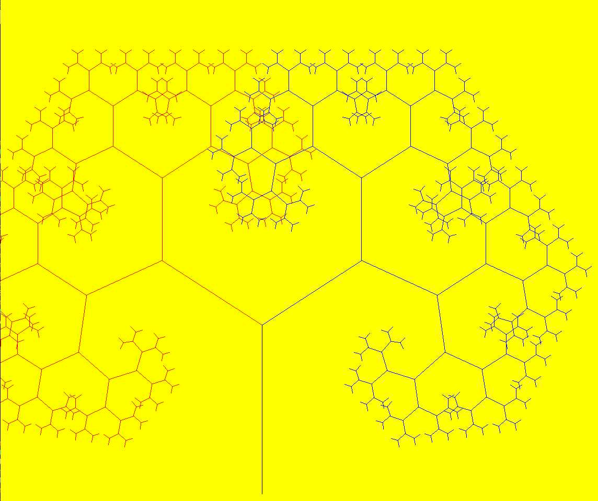

# Fractal Tree Pattern

## Generating fractal tree patterns using `pygame` python library

### Steps to reproduce
* Clone the repository or download and extract the zip folder.

* Install requirements like pygame by running the following command inside the cloned repository.

    `pip install -r requirements.txt`

* Run the python code to generate python tree pattern

    `python fractals.py <iterations>`

    eg : python fractals.py 100 will run 100 iterations for the generating function
